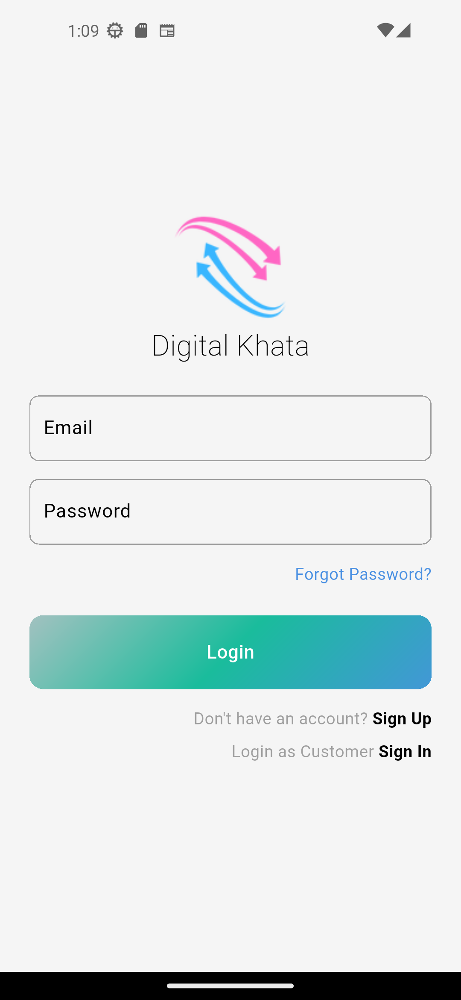
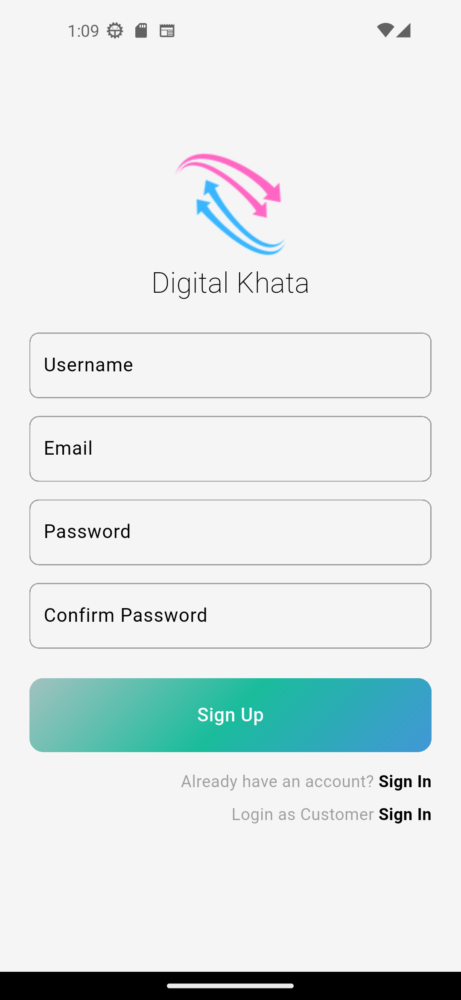
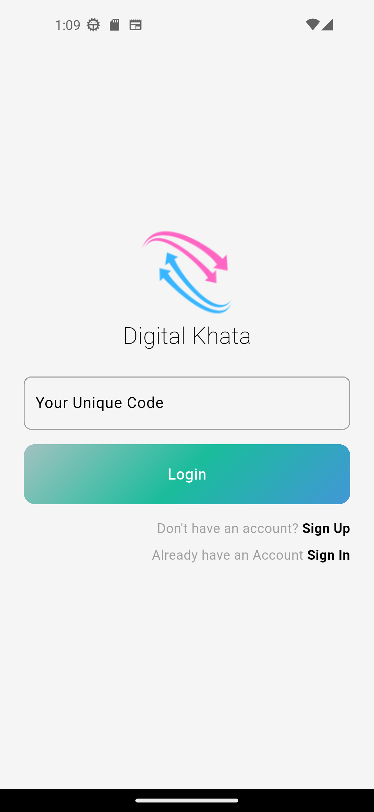
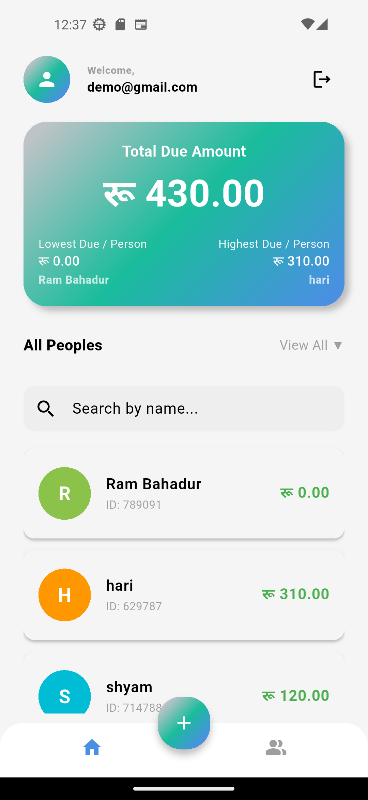
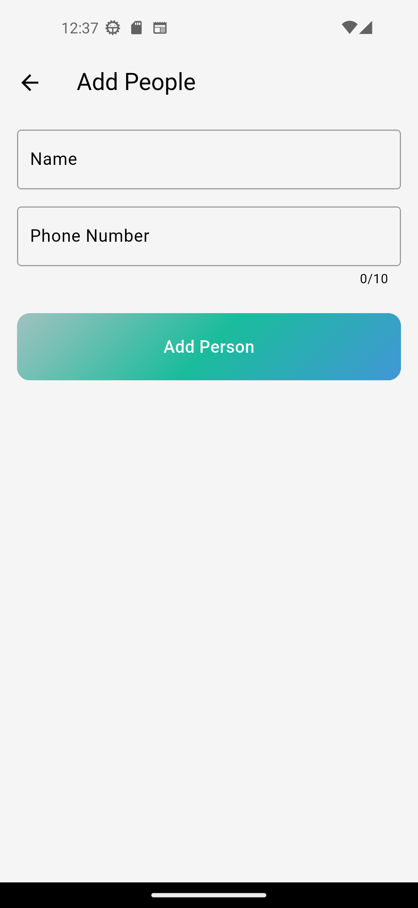
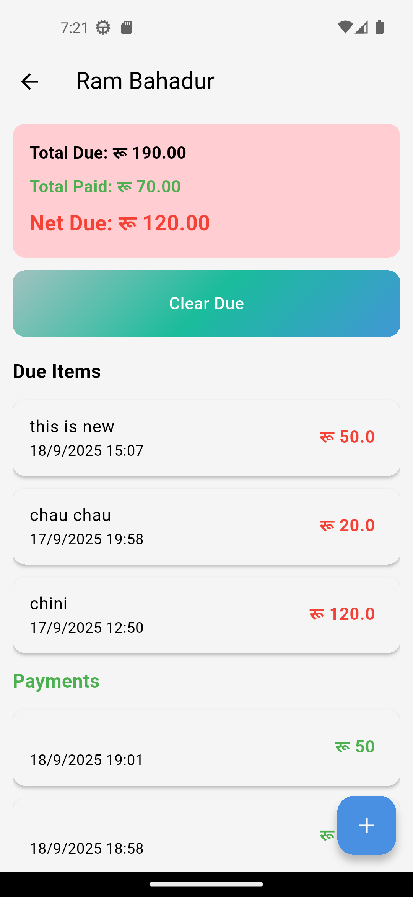
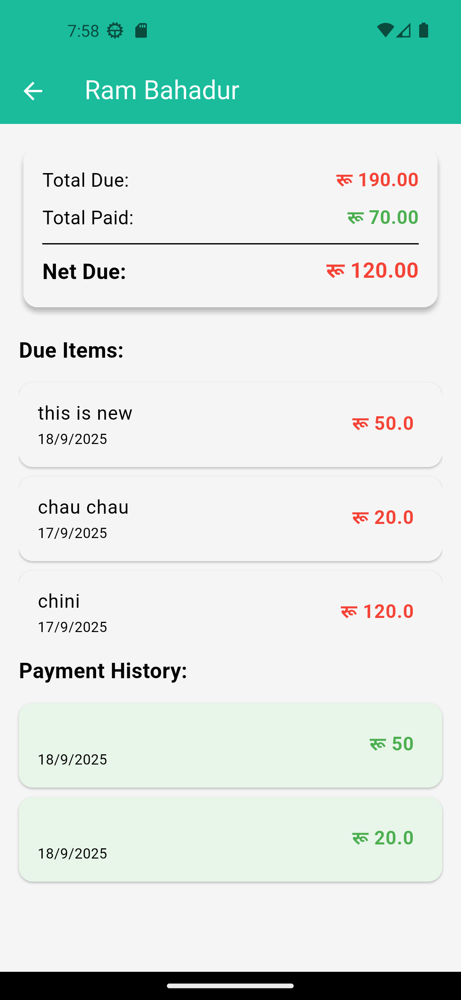
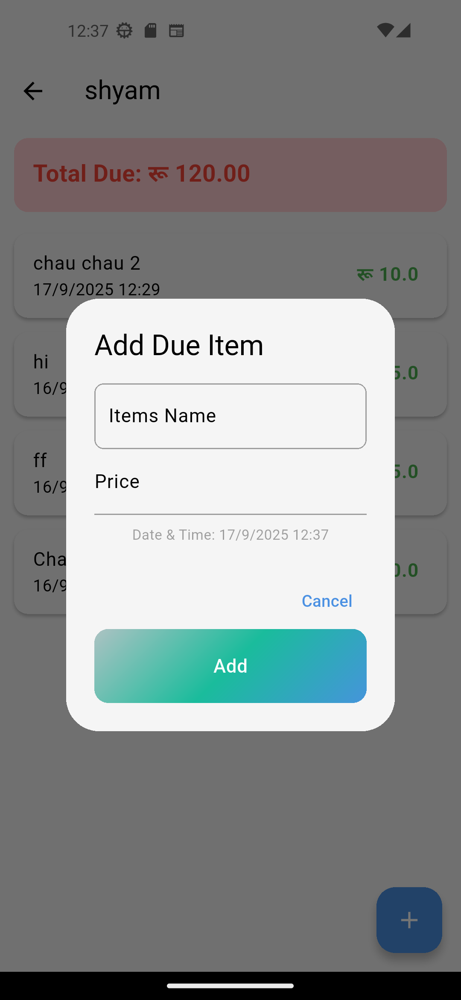
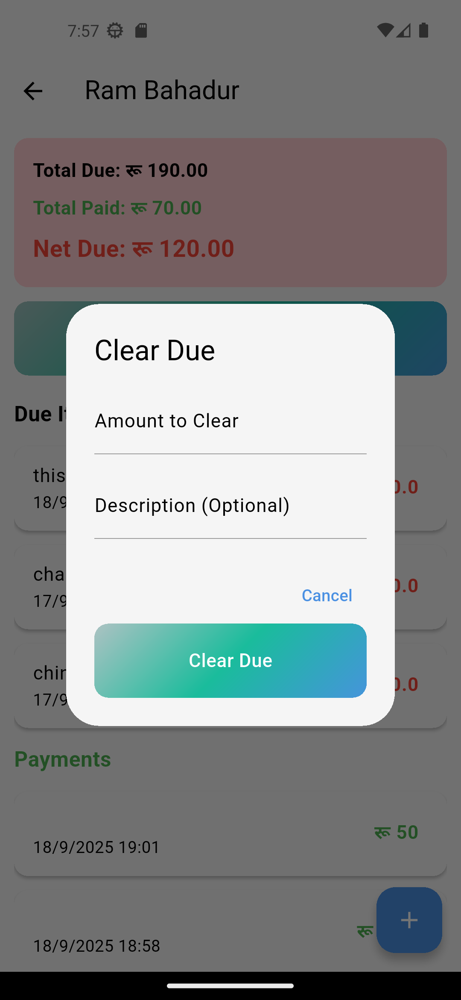
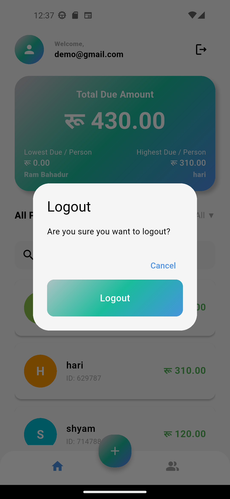

# Digital खाता (Digital Account Book)

<div align="center">
  

  **A comprehensive digital ledger application for shop owners to manage customer accounts, track dues, and maintain purchase history.**
</div>

## 📱 Overview

Digital Khata is a Flutter-based mobile application designed to help shop owners and small business owners manage their customer accounts digitally. The app provides a complete solution for tracking customer dues, recording payments, and maintaining detailed transaction histories with beautiful UI.

## ✨ Key Features

### 🔐 Authentication & Security
- **Firebase Authentication** - Secure user authentication system
- **Email-based login/signup** - Easy account creation and management
- **Session management** - Automatic login state handling

### 👥 Customer Management
- **Add new customers** - Register customers with unique IDs
- **Customer search** - Find customers quickly by name or ID
- **Customer profiles** - Detailed customer information management
- **Bulk operations** - Efficient customer data handling

### 💰 Financial Tracking
- **Due amount tracking** - Record and monitor outstanding amounts
- **Payment recording** - Log all customer payments
- **Transaction history** - Complete audit trail of all transactions
- **Real-time calculations** - Automatic total calculations

### 📊 Dashboard & Analytics
- **Total due overview** - See combined outstanding amounts
- **Individual customer totals** - Track each customer's balance
- **Highest/Lowest due identification** - Quick insights into customer accounts
- **Visual summaries** - Beautiful gradient cards with key metrics

### 🌐 Localization (Planned)
- **Nepali language support** - Full Nepali localization 
- **Custom fonts** - Kalimati font for authentic Nepali text rendering
- **Cultural adaptation** - Designed for Nepali business practices

## 🛠 Technology Stack

- **Framework**: Flutter 3.8.1+
- **Backend**: Firebase (Auth, Firestore, Storage)
- **Authentication**: Firebase Auth 6.0.2+
- **Database**: Cloud Firestore 6.0.1+
- **Storage**: Firebase Storage 13.0.1+

## 📋 Prerequisites

Before running this application, make sure you have the following installed:

- **Flutter SDK** (3.8.1 or higher)
- **Dart SDK** (included with Flutter)
- **Android Studio** (for Android development)
- **Xcode** (for iOS development)
- **Firebase Account** with a configured project

## 🚀 Installation

### 1. Clone the Repository
```bash
git clone https://github.com/4bhisheksharma/digital-khata.git
cd digital-khata
```

### 2. Install Dependencies
```bash
flutter pub get
```

### 3. Firebase Setup

#### Create a Firebase Project
1. Go to [Firebase Console](https://console.firebase.google.com/)
2. Create a new project or use an existing one
3. Enable **Authentication** and **Firestore Database**

#### Configure Firebase for Flutter
1. Install Firebase CLI: `npm install -g firebase-tools`
2. Login to Firebase: `firebase login`
3. Initialize Firebase in your project: `firebase init`
4. Download the configuration files:
   - For Android: Download `google-services.json` and place it in `android/app/`
   - For iOS: Download `GoogleService-Info.plist` and place it in `ios/Runner/`

#### Update Firebase Configuration
1. Update the Firebase configuration in `lib/firebase_options.dart`
2. Ensure Firestore security rules allow appropriate access

### 4. Run the Application
```bash
# For Android
flutter run

# For iOS
flutter run --ios

# For Web (if configured)
flutter run -d chrome
```

## 📱 Usage

### Getting Started
1. **Launch the app** - Open Digital Khata on your device
2. **Sign up/Login** - Create a new account or login with existing credentials
3. **Add customers** - Use the floating action button to add new customers
4. **Manage dues** - Tap on any customer to add due amounts or record payments
5. **View dashboard** - Monitor your business metrics on the main screen

## 📸 Screenshots

### Authentication Screens
#### Login Page


#### Signup Page


#### Customer Login


### Main Application Screens
#### Home Dashboard


#### Customer List


#### Customer Details


#### Customer Dashboard


### Transaction Management
#### Add Due Amount


#### Clear Due Dialog


#### Logout Screen


### Main Screens

#### 🏠 Home Dashboard
- Overview of total outstanding amounts
- Quick access to customer list
- Summary statistics (highest/lowest dues)
- Search functionality

#### 👥 Customer Management
- **Add People Screen** - Register new customers with unique IDs
- **List People Screen** - Browse all registered customers
- **Customer Details** - View individual customer transaction history

#### 💳 Transaction Management
- **Add Due Amount** - Record new purchases/credits
- **Payment Recording** - Log customer payments
- **Transaction History** - Complete audit trail

## 🏗 Project Structure

```
lib/
├── components/          # Reusable UI components
│   ├── my_button.dart
│   └── my_text_field.dart
├── controller/          # controllers
│   ├── auth.dart
│   └── toggle_login_signup.dart
├── helper/              # Utility functions
│   └── helper_function.dart
├── models/              # Data models (if any)
├── screens/             # UI screens
│   ├── auth/           # Authentication screens
│   ├── content/        # Main app screens
│   │   ├── home/       # Home screen components
│   │   ├── people/     # Customer management
│   │   └── transaction/# Transaction screens
│   └── customer/       # Customer-specific screens
├── services/           # Business logic and API calls
│   ├── customer_service.dart
│   └── services.dart
```

## 🎨 UI/UX Features

- **Modern Design** - Clean, intuitive interface
- **Gradient Themes** - Beautiful color schemes
- **Responsive Layout** - Works on various screen sizes
- **Smooth Animations** - Enhanced user experience


### App Configuration
- Update `pubspec.yaml` for dependency management
- Configure Firebase options in `lib/firebase_options.dart`
- Customize themes in `lib/app_view.dart`

## Contributing

We welcome contributions! Please follow these steps:

1. Fork the repository
2. Create a feature branch: `git checkout -b feature/amazing-feature`
3. Commit your changes: `git commit -m 'Add amazing feature'`
4. Push to the branch: `git push origin feature/amazing-feature`
5. Open a Pull Request

## License

This project is Open Source.

<div align="center">
  <p><strong>Built with ❤️ for the Nepali business community</strong></p>
  <p>Empowering shop owners with digital transformation</p>
</div>
# Digital_khata
